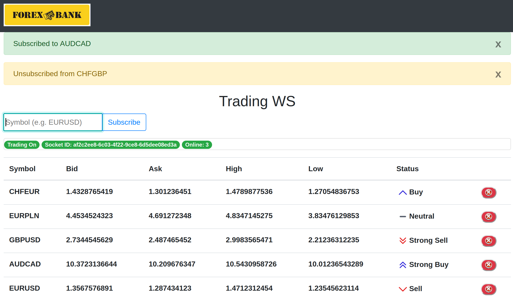
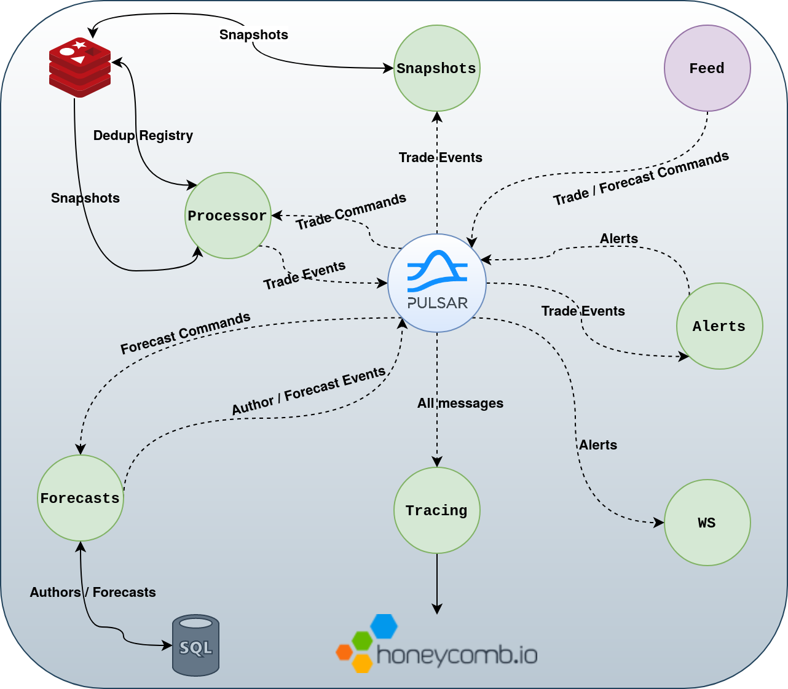
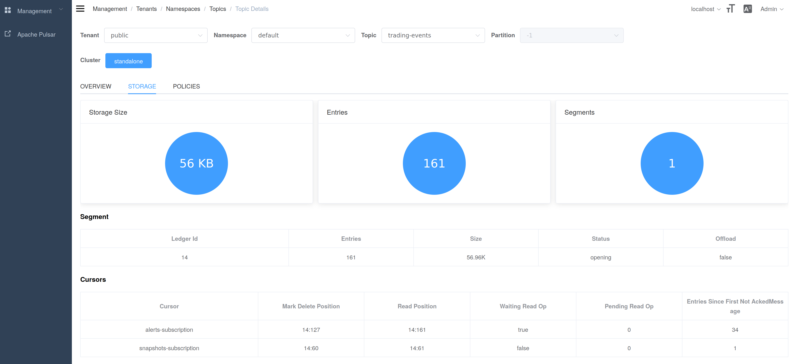
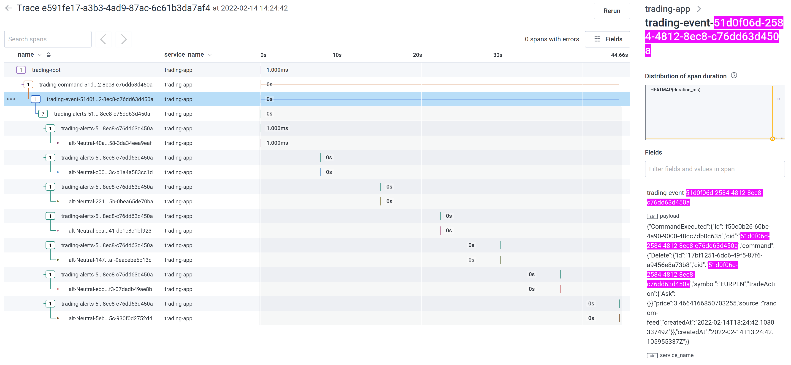
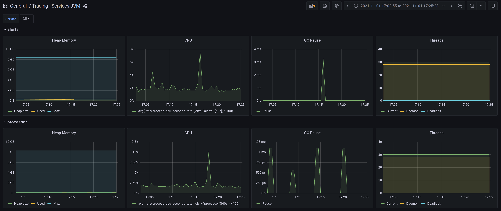

trading
=======

[](https://github.com/gvolpe/trading/actions)
[](https://github.com/gvolpe/trading/actions)
[](https://github.com/gvolpe/trading/actions)
[](https://github.com/gvolpe/trading/actions/workflows/ci-images.yml)
[](https://github.com/gvolpe/trading/actions/workflows/ci-smokey.yml)

Reference application developed in the [Functional event-driven architecture: Powered by Scala 3](https://leanpub.com/feda) book.

## Table of contents

* [Web App](#web-app)
   * [ScalaJS](#scalajs)
* [Overview](#overview)
* [Requirements](#requirements)
* [Services](#services)
   * [Lib](#lib)
   * [Domain](#domain)
   * [Core](#core)
   * [Feed](#feed)
   * [Forecasts](#forecasts)
   * [Processor](#processor)
   * [Snapshots](#snapshots)
   * [Alerts](#alerts)
   * [WS Server](#ws-server)
   * [Tracing](#tracing)
   * [Tests](#tests)
   * [X Demo](#x-demo)
   * [X QA](#x-qa)
* [Monitoring](#monitoring)
* [Topic compaction](#topic-compaction)

## Web App

The web application allows users to subscribe/unsubscribe to/from symbol alerts such as `EURUSD`, which are emitted in real-time via Web Sockets.



It is written in [Elm](https://elm-lang.org/) and can be built as follows.

```shell
$ cd web-app && nix-build
$ xdg-open result/index.html # or specify browser
```

There's also a `shell.nix` handy for local development.

```shell
$ cd web-app && nix-shell
$ elm make src/Main.elm --output=Main.js
$ xdg-open index.html # or specify browser
```

If Nix is not your jam, you can install Elm by following the [official instructions](https://guide.elm-lang.org/install/elm.html) and then compile as usual.

```shell
$ cd web-app
$ elm make src/Main.elm --output=Main.js
$ xdg-open index.html # or specify browser
```

### ScalaJS

There is also a replica of the Elm application written in Scala using the [Tyrian](https://tyrian.indigoengine.io/) framework. First, we need to compile the Scala app to JavaScript and copy the file to the root directory of the `ws-client` module (this last task is only required for `nix run`).

```console
$ cd modules/ws-client
$ sbt 'webapp/fastLinkJS;webapp/copyJsFileTask'
```

You can then run it via Nix as follows (it requires [flakes](https://nixos.wiki/wiki/Flakes)).

```console
$ nix run
Using cache dir: /home/gvolpe/workspace/trading/modules/ws-client/nix-parcel-cache
Server running at http://localhost:1234
✨ Built in 7ms
```

NOTICE: The `nix run` comand will create a directory for the Parcel cache, which needs write permissions.

For development iterations, it may be more convenient to use `yarn` directly.

```console
$ nix develop
$ yarn install
$ yarn build
$ yarn start
yarn run v1.22.17
parcel index.html --no-cache --dist-dir dist --log-level info
Server running at http://localhost:1234
✨ Built in 1.82s
```

However, this is not fully reproducible and can't be guaranteed this will work in the future.

Without Nix, you need to install `yarn` and `parcel`, and use `yarn` as shown above.

## Overview

Here's an overview of all the components of the system.



- Dotted lines: Pulsar messages such as commands and events.
- Bold lines: read and writes from / to external components (Redis, Postgres, etc).

## Requirements

The back-end application is structured as a mono-repo, and it requires both Apache Pulsar and Redis up and running. To make things easier, you can use the provided `docker-compose.yml` file.

### Build JDK image

The `docker-compose` file depends on declared services to be published on the local docker server. All docker builds are handled within the `build.sbt` using `sbt-native-packager`. 

To build all of the service images, we have a few options. 

The first one via the given [Dockerfile](./modules/Dockerfile).

```shell 
$ docker build -t jdk17-curl modules/
```

The second one via Nix, from where we can build a slim image also based on `openjdk:17-slim-buster`.

```console 
$ nix build .#slimDocker -o result-jre
$ docker load -i result-jre
```

The third one also via Nix, though building a layered image based on the same JDK we use for development.

```console 
$ nix build .#docker -o result-jre
$ docker load -i result-jre
```

The main difference between these three options is the resulting image size.

```console
$ docker images | rg jdk17
jdk17-curl                    latest               0ed94a723ce3   10 months ago   422MB
jdk17-curl-nix                latest               c28f54e42c21   52 years ago    557MB
jdk17-curl-slim               latest               dbe24e7a7163   52 years ago    465MB
```

Any image is valid. Feel free to pick your preferred method.

NOTE: As of September 2022, the Docker image resulting from `nix build .#docker` is no longer compatible with `sbt-native-packager`, so either go for `nix build` (defaults to the slim image) or build it directly via Docker with the given Dockerfile.

### Build service images

Once the base `jdk17-curl` image has been built, we can proceed with building all our services' images.

```shell 
$ sbt docker:publishLocal
```

### Run dependencies: Redis, Kafka, etc

```shell
$ docker-compose up -d pulsar redis
```



To run the Kafka Demo (see more below in [X Demo](#x-demo)), only Zookeeper and Kafka are needed.

```shell
$ docker-compose -f kafka.yml up
```

### Running application

If we don't specify any arguments, then all the containers will be started, including all our services (except `feed`), Prometheus, Grafana, and Pulsar Manager.

```console
$ docker-compose up
Creating network "trading_app" with the default driver
Creating trading_pulsar_1 ... done
Creating trading_redis_1  ... done
Creating trading_ws-server_1      ... done
Creating trading_pulsar-manager_1 ... done
Creating trading_alerts_1         ... done
Creating trading_processor_1      ... done
Creating trading_snapshots_1      ... done
Creating trading_forecasts_1      ... done
Creating trading_tracing_1        ... done
Creating trading_prometheus_1     ... done
Creating trading_grafana_1        ... done
```

It is recommended to run the `feed` service directly from `sbt` whenever necessary, which publishes random data to the topics where other services are consuming messages from.

## Services

The back-end application consists of 9 modules, from which 5 are deployable applications, and 3 are just shared modules. There's also a demo module and a web application.

```
modules
├── alerts
├── core
├── domain
├── feed
├── forecasts
├── it
├── lib
├── processor
├── snapshots
├── tracing
├── ws-client
├── ws-server
└── x-demo
```


### Lib

Capability traits such as `Logger`, `Time`, `GenUUID`, and potential library abstractions such as `Consumer` and `Producer`, which abstract over different implementations such as Kafka and Pulsar.

### Domain

Commands, events, state, and all business-related data modeling.

### Core

Core functionality that needs to be shared across different modules such as snapshots, `AppTopic`, and `TradeEngine`.

### Feed

Generates random `TradeCommand`s and `ForecastCommand`s followed by publishing them to the corresponding topics. In the absence of real input data, this random feed puts the entire system to work.

### Forecasts

Registers new authors and forecasts, while calculating the author's reputation.

### Processor

The brain of the trading application. It consumes `TradeCommand`s, processes them to generate a `TradeState` and emitting `TradeEvent`s via the `trading-events` topic.

### Snapshots

It consumes `TradeEvent`s and recreates the `TradeState` that is persisted as a snapshot, running as a single instance in fail-over mode.

### Alerts

The alerts engine consumes `TradeEvent`s and emits `Alert` messages such as `Buy`, `StrongBuy` or `Sell` via the `trading-alerts` topic, according to the configured parameters.

### WS Server

It consumes `Alert` messages and sends them over Web Sockets whenever there's an active subscription for the alert.

### Tracing

A decentralized application that hooks up on multiple topics and creates traces via the Open Tracing protocol, using the Natchez library and Honeycomb.



### Tests

All unit tests can be executed via `sbt test`. There's also a small suite of integration tests that can be executed via `sbt it/test` (it requires Redis to be up).

### X Demo

It contains all the standalone examples shown in the book. It also showcases both `KafkaDemo` and `MemDemo` programs that use the same `Consumer` and `Producer` abstractions defined in the `lib` module. 

#### Pulsar CDC

To run the Pulsar CDC Demo, you need Postgres and Pulsar (make sure no other instances are running). Before running them, we need to download the connector NAR file.

```shell
$ mkdir -p pulsarconf/connectors && cd pulsarconf/connectors
$ wget https://archive.apache.org/dist/pulsar/pulsar-2.10.1/connectors/pulsar-io-debezium-postgres-2.10.1.nar
$ docker-compose -f pulsar-cdc.yml up
```

Once both instances are up and healthy, we can run the Pulsar Debezium connector.

```console
$ docker-compose exec -T pulsar bin/pulsar-admin source localrun --source-config-file /pulsar/conf/debezium-pg.yaml
```

You should see this in the logs.

```console
Snapshot step 3 - Locking captured tables [public.authors]
```

### X QA

It contains the `smokey` project that models the smoke test for trading.

## Monitoring

JVM stats are provided for every service via Prometheus and Grafana.



## Topic compaction

Two Pulsar topics can be compacted to speed-up reads on startup, corresponding to `Alert` and `TradeEvent.Switch`.

To compact a topic on demand (useful for manual testing), run these commands.

```console
$ docker-compose exec pulsar bin/pulsar-admin topics compact persistent://public/default/trading-alerts
Topic compaction requested for persistent://public/default/trading-alerts.
$ docker-compose exec pulsar bin/pulsar-admin topics compact persistent://public/default/trading-switch-events
Topic compaction requested for persistent://public/default/trading-switch-events
```

In production, one would configure topic compaction to be triggered automatically at the namespace level when certain threshold is reached. For example, to trigger compaction when the backlog reaches 10MB:

```console
$ docker-compose exec pulsar bin/pulsar-admin namespaces set-compaction-threshold --threshold 10M public/default
```
